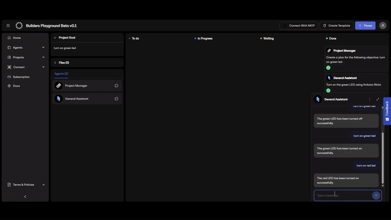

# MCP Proxy

## What is MCP Proxy?

**MCP Proxy** is a bridge between the [OpenServ](https://openserv.ai) agent ecosystem and your own backend services. While it is designed with OpenServ in mind, it can be used with **any client that speaks the [Model Context Protocol (MCP)](https://modelcontextprotocol.io/)**. It allows you to define, manage, and expose custom "tools" (API endpoints) to MCP clients using a simple admin interface. Each tool is described with a name, description, and parameter schema, and is mapped to a backend endpoint.

<p align="center">
  
</p>

<p align="center"><em>An illustrated metaphor</em></p>

### Words to Know

- **Application Name**: A unique identifier for your integration. Each Application has its own backend URL and set of tools.
- **Backend URL**: The base URL where your backend services live. Each tool is mapped to a POST endpoint at `${backendUrl}/${toolName}`.
- **Tools**: Each tool is a function or API endpoint you want to expose to MCP clients. You define its name, description, and parameters in the admin UI.
- **Parameter Schema**: Each tool has a schema describing the expected parameters (name, type, description) for validation and documentation.

### How it Works

1. **Configure an Application**

   - Go to `/admin` and enter a new Application Name and your backend URL.
   - Define tools for this application, specifying their names, descriptions, and parameters.

2. **Proxying Requests**

   - When an MCP client connects (via `/mcp?applicationName=...` or `/sse?applicationName=...`), the proxy loads the tools and backend URL for that Application Name.
   - When the client calls a tool, MCP Proxy validates the parameters and forwards the request as a POST to your backend at `${backendUrl}/${toolName}`.
   - The backend responds with JSON, which is returned to the client.

3. **Multi-Application Support**
   - You can manage multiple Applications, each with its own backend and tool set.
   - This allows you to host multiple integrations or environments from a single MCP Proxy instance.

### Example Use Case

Suppose you have a backend with endpoints like `/weather`, `/stock`, and `/translate`.  
You want MCP clients (such as OpenServ agents) to be able to call these as tools.

- In the admin UI, set Application Name: `my-company`
- Backend URL: `https://api.mycompany.com`
- Add tools:
  - `weather` (parameters: city, country)
  - `stock` (parameters: symbol)
  - `translate` (parameters: text, targetLanguage)

Now, any MCP-compatible client can connect to your MCP Proxy with `?applicationName=my-company` and call these tools. The proxy will forward the requests to your backend, validate parameters, and return the results.

---

#### Real Hardware Example: Arduinogent



You can use MCP Proxy to connect real-world devices to MCP clients. For example, we created **Arduinogent**: a simple Arduino web server that exposes tool endpoints directly from an Arduino board. This lets you control or query your Arduino from any MCP-compatible client!

- In the admin UI, set Application Name: `arduino-lab`
- Backend URL: `http://<your-arduino-ip>` (a private, plain-HTTP backend, so set
  `BACKEND_ALLOWED_HOSTS` and `BACKEND_ALLOW_HTTP` - see [Backend
  URLs](#backend-urls))
- Add tools, e.g.:
  - `led` (parameters: state)
  - `temperature` (no parameters)

**Example Arduino code:**

```cpp
const char* ssid = "YOUR_WIFI_SSID";
const char* password = "YOUR_WIFI_PASSWORD";
WebServer server(80);

void handleLed() {
  String body = server.arg("plain");
  // Parse JSON body for { "state": "on" } or { "state": "off" }
  if (body.indexOf("on") >= 0) {
    digitalWrite(LED_BUILTIN, LOW); // turn LED on
    server.send(200, "application/json", "{\"result\":\"LED on\"}");
  } else {
    digitalWrite(LED_BUILTIN, HIGH); // turn LED off
    server.send(200, "application/json", "{\"result\":\"LED off\"}");
  }
}

void handleTemperature() {
  float temp = 23.5; // Replace with real sensor reading
  server.send(200, "application/json", String("{\"temperature\":") + temp + "}");
}

void setup() {
  pinMode(LED_BUILTIN, OUTPUT);
  WiFi.begin(ssid, password);
  while (WiFi.status() != WL_CONNECTED) delay(500);
  server.on("/led", HTTP_POST, handleLed);
  server.on("/temperature", HTTP_POST, handleTemperature);
  server.begin();
}

void loop() {
  server.handleClient();
}
```

Now, you can control your Arduino from any MCP client via MCP Proxy, just like any other backend!

---

## Why use MCP Proxy?

- **No code changes to your backend**: Just expose POST endpoints.
- **Centralized tool management**: Add, update, or remove tools via the admin UI.
- **Parameter validation**: Ensures clients send the right data.
- **Multi-tenant**: Host multiple integrations with different backends.
- **MCP compatibility**: Works out-of-the-box with OpenServ agents and any other MCP client.

---

## Installation

### Setup

1. Clone the repository:

   ```bash
   git clone https://github.com/openserv-labs/mcp-proxy.git
   cd mcp-proxy
   ```

2. Install dependencies:

   ```bash
   npm install
   ```

3. Create a `.env` file in the project root (see `.env.example`):

   ```
   PORT=3000
   HOST=127.0.0.1
   MONGODB_URI=mongodb://localhost:27017/mcp-proxy
   ADMIN_TOKEN=<a long random secret>
   CORS_ORIGINS=
   LOG_LEVEL=info
   ```

   Generate the admin token with `openssl rand -hex 32`. **The admin API is
   disabled until `ADMIN_TOKEN` is set** - see [Securing the admin
   API](#securing-the-admin-api).

4. Build the project:

   ```bash
   npm run build
   ```

5. Start the server:
   ```bash
   npm start
   ```

## Securing the admin API

The admin API (`/admin/api/*`) reads and writes the backend URL and tool
definitions for every application, so it is protected by an admin credential.

### Admin token

Every `/admin/api/*` request must carry the `ADMIN_TOKEN` as a bearer token:

```bash
curl http://127.0.0.1:3000/admin/api/tools \
  -H "Authorization: Bearer $ADMIN_TOKEN" \
  -H "X-Application-Name: my-company"
```

`X-Application-Name` selects which application to act on; it is not a
credential. The admin UI at `/admin` prompts for the token and keeps it in the
tab's `sessionStorage` only.

The server fails closed: if `ADMIN_TOKEN` is unset or shorter than 16
characters, every admin API request is rejected with `503` and the reason is
logged at startup.

### Network binding

The server binds `127.0.0.1` by default. To expose it, set `HOST=0.0.0.0` -
only behind a firewall or reverse proxy, and only with `ADMIN_TOKEN` set.

### CORS

Cross-origin requests are refused unless `CORS_ORIGINS` lists the exact origins
you want to allow (comma-separated), for example
`CORS_ORIGINS=https://admin.example.com`. Setting `CORS_ORIGINS=*` restores the
old allow-anything behaviour and is not recommended.

### Backend URLs

An application's backend URL is fetched server-side, so a bad value turns the
proxy into a relay into its own network. Backend URLs are therefore validated
when they are stored **and** re-checked on every tool call, and the connection
itself is restricted.

By default a backend URL must:

- use `https`, with no embedded credentials and no query string or fragment;
- point at a public host - loopback, private, link-local, carrier-grade NAT and
  reserved ranges are refused, including the `169.254.169.254` and
  `fd00:ec2::254` cloud metadata endpoints.

Host names are additionally checked against the addresses they actually resolve
to, at the moment the connection is made, so a name that resolves into private
space cannot be used to get around the rule. Redirects are not followed, so a
backend cannot bounce the proxy inward either.

Two settings adjust this:

| Variable                | Effect                                                                                                                                                                          |
| ----------------------- | ------------------------------------------------------------------------------------------------------------------------------------------------------------------------------- |
| `BACKEND_ALLOWED_HOSTS` | Comma-separated allow list; an entry may start with `*.` to match subdomains. When set, only these hosts are reachable, and they are trusted (private addresses are permitted). |
| `BACKEND_ALLOW_HTTP`    | Set truthy to permit `http://` backends.                                                                                                                                        |

### Backend request limits

| Variable                     | Default   | Effect                                                                                                               |
| ---------------------------- | --------- | -------------------------------------------------------------------------------------------------------------------- |
| `BACKEND_TIMEOUT_MS`         | `15000`   | Total deadline for a backend call - not an idle timeout, so a tool that legitimately takes longer needs this raised. |
| `BACKEND_MAX_RESPONSE_BYTES` | `1048576` | Largest backend response the proxy will read. Larger responses fail the tool call.                                   |

To reach a backend on a private network - the Arduino example above, or a
service on `localhost` - name it explicitly and allow plain HTTP:

```
BACKEND_ALLOWED_HOSTS=192.168.1.50
BACKEND_ALLOW_HTTP=true
```

Note that `/mcp` and `/sse` are the client-facing endpoints and carry no
credential of their own, so anyone who knows an application name can trigger a
tool call. The control on that path is which URLs the proxy is willing to
fetch, not who may ask it to.

## Contributing

Contributions are welcome! Please feel free to submit a Pull Request. For major changes, please open an issue first to discuss what you would like to change.

1. Fork the repository
2. Create your feature branch (`git checkout -b feature/AmazingFeature`)
3. Commit your changes (`git commit -m 'Add some AmazingFeature'`)
4. Push to the branch (`git push origin feature/AmazingFeature`)
5. Open a Pull Request

## License

```
MIT License

Copyright (c) 2025 OpenServ Labs

Permission is hereby granted, free of charge, to any person obtaining a copy
of this software and associated documentation files (the "Software"), to deal
in the Software without restriction, including without limitation the rights
to use, copy, modify, merge, publish, distribute, sublicense, and/or sell
copies of the Software, and to permit persons to whom the Software is
furnished to do so, subject to the following conditions:

The above copyright notice and this permission notice shall be included in all
copies or substantial portions of the Software.

THE SOFTWARE IS PROVIDED "AS IS", WITHOUT WARRANTY OF ANY KIND, EXPRESS OR
IMPLIED, INCLUDING BUT NOT LIMITED TO THE WARRANTIES OF MERCHANTABILITY,
FITNESS FOR A PARTICULAR PURPOSE AND NONINFRINGEMENT. IN NO EVENT SHALL THE
AUTHORS OR COPYRIGHT HOLDERS BE LIABLE FOR ANY CLAIM, DAMAGES OR OTHER
LIABILITY, WHETHER IN AN ACTION OF CONTRACT, TORT OR OTHERWISE, ARISING FROM,
OUT OF OR IN CONNECTION WITH THE SOFTWARE OR THE USE OR OTHER DEALINGS IN THE
SOFTWARE.

```
